# Setup Xcode for GPU Frame Capture

Xcode needs to be able to attach to a process to be able to instrument and
profile it.

As you are working on Impeller, it is easiest to set up an Xcode project just to
bring Impeller artifacts up-to-date, launch the required test binary, enable
Metal validation layer, and either capture a GPU frame or instrument the test
case with Instruments.

If you are already somewhat familiar with Xcode, none of this is new. If not,
follow along.

# Set Up an Xcode Project for Instrumentation

In Xcode, `File -> New -> Project…`, select an empty project.

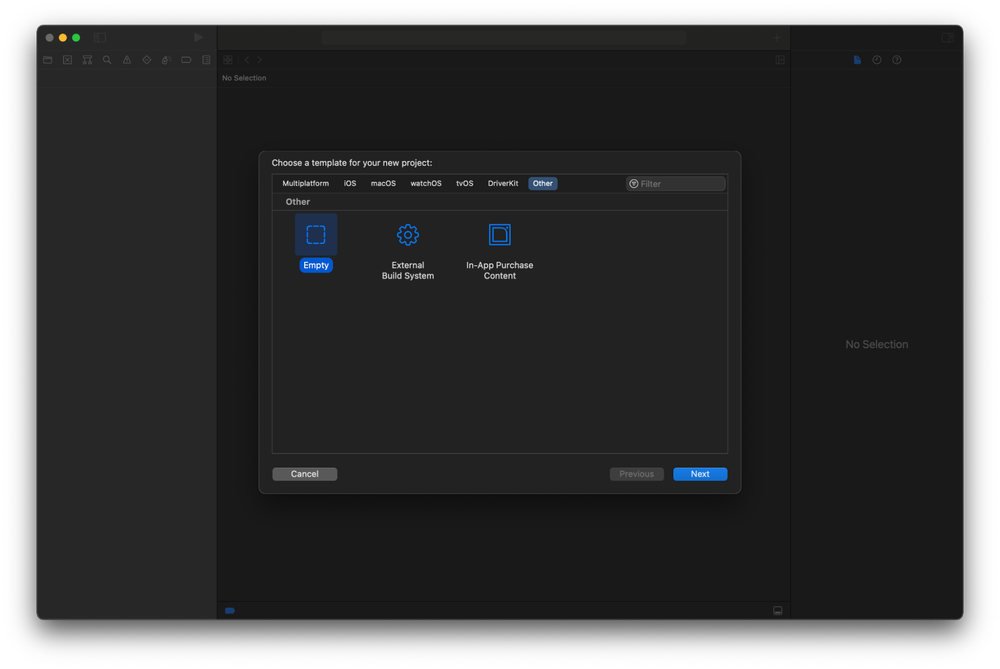

Call it whatever you want, you are not going to check this into version control
and the targets are going to be specific to your workflow.

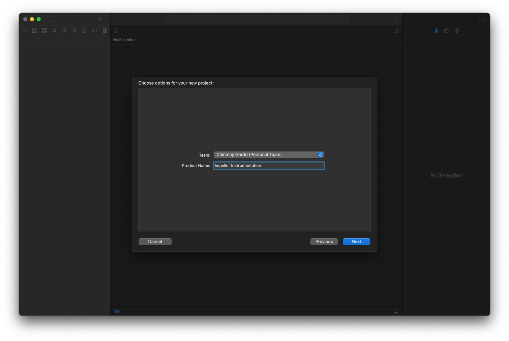

Save it outside the source tree. Since you are not going to check this in, you
don’t want to accidentally delete it via a `git clean -fdx` when regenerating
the licenses (ask me how I know).

Create a new `External Build System` target in the empty project by clicking on
the `+` icon at the bottom.

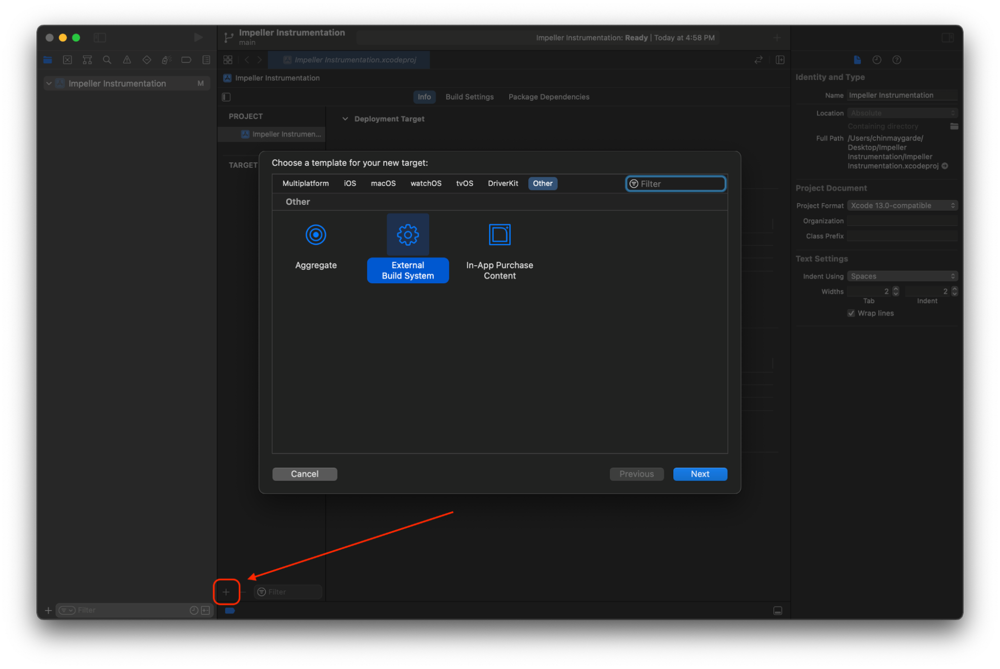

Click through the defaults (it wants you to use `make`) to create the target, we
are going to be modifying it later.

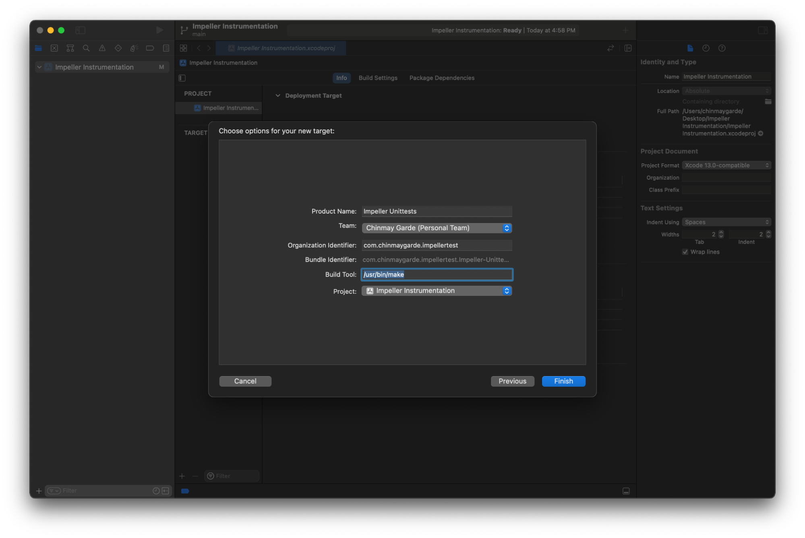

Select the target you just created from the sidebar and in the `Info` tab, fill
in the command you would use to bring the target up-to-date. In the example, I
am building the Impeller unit-tests.

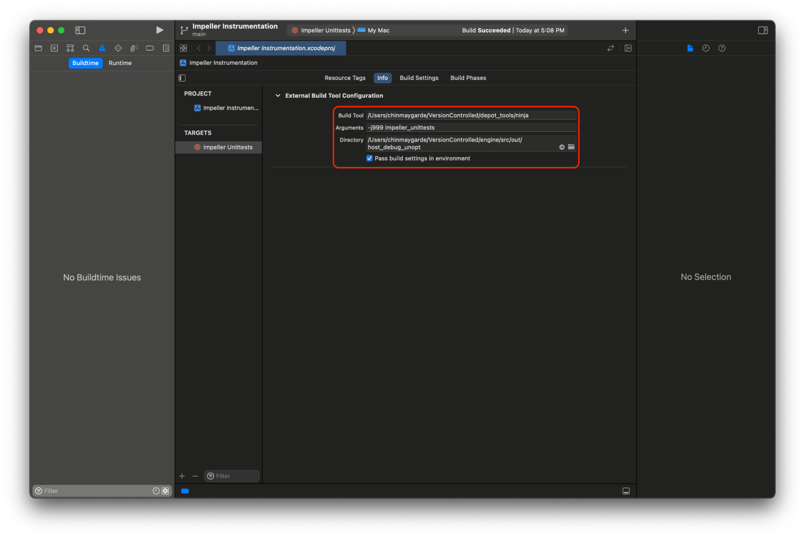

If you wanted to instrument multiple targets and switch between them, you would
add them here.

Xcode still doesn’t know how to launch the executables generated by the targets
however. You need to specify a Run Scheme for that. We’ll do that next.

Click the default scheme for the target.

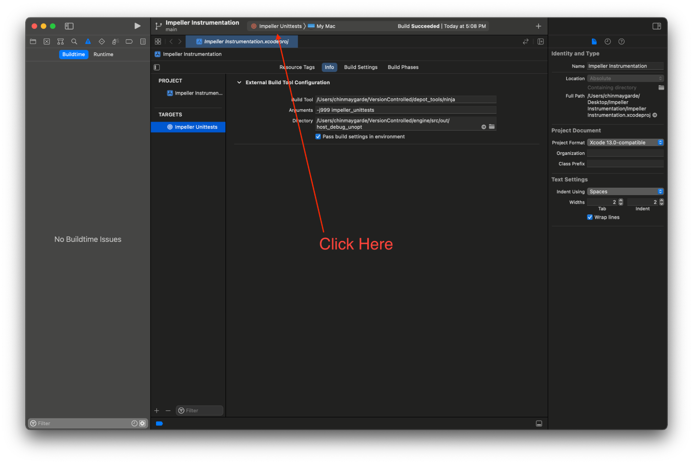

In the Pop-Up, click `Edit Scheme`.

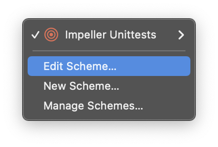

In the Info tab, select the executable you want to launch after the target has
been updated by clicking on `Other…`.

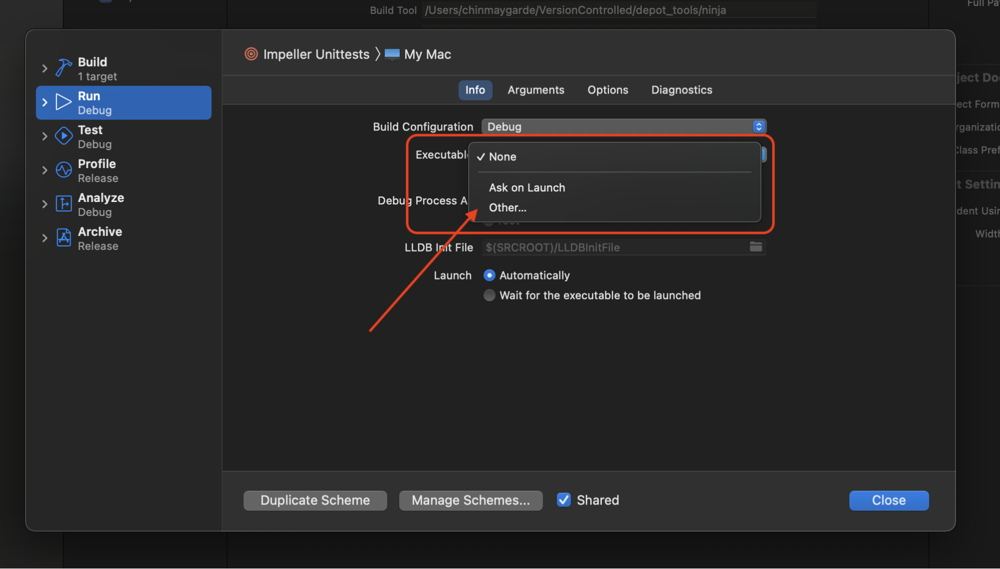

I want to launch the unit-tests harness. Select it in the `out` directory.

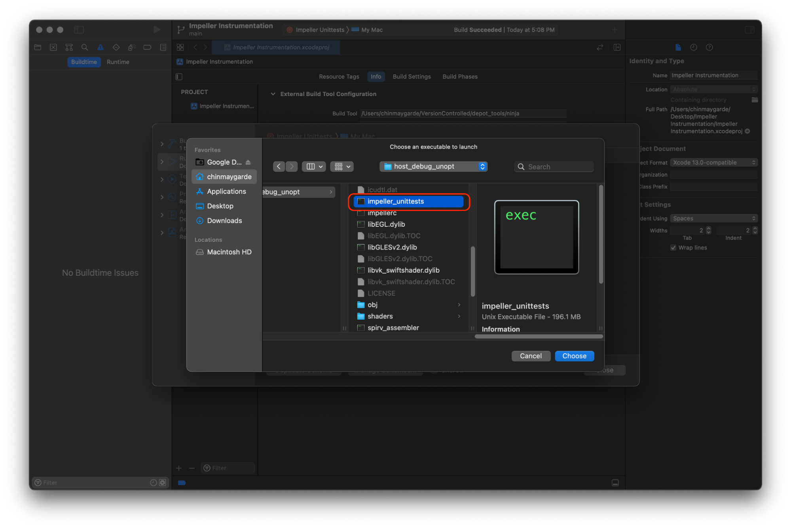

Now, when you click `Product -> Run` in Xcode, the unit-tests target will be
brought up to data and run.

# Enabling Metal Validation & GPU Frame Capture

Xcode doesn’t know that the executable you are trying to instrument is Metal
enabled. You just asked it to launch a random executable it knows nothing about.

In the `Options` tab on the `Edit Scheme…` pop-up, in the `GPU Frame Capture`
section, set API detection to `Metal` and check `Profile GPU trace after
capture`.

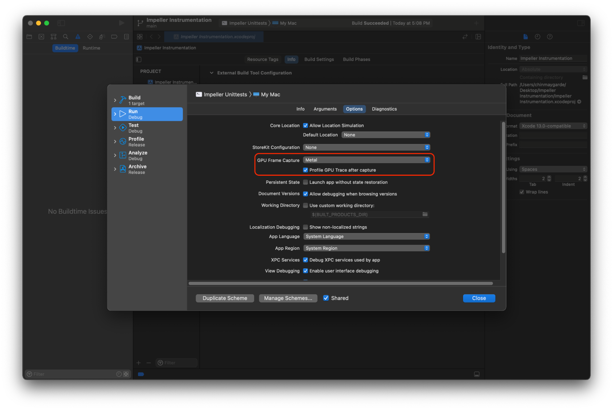

Then, in the `Diagnostics` tab on the `Edit Scheme…` pop-up, in the `Metal`
section, enable `API Validation` and `Shader Validation`.

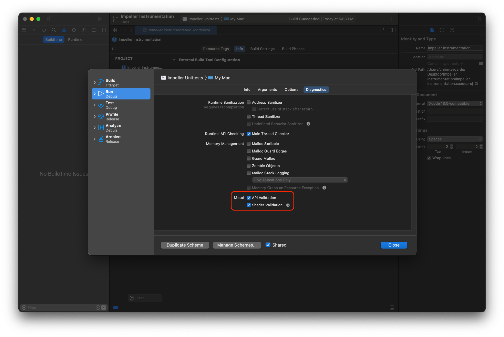

On a side note, you may be tempted to enable all the other diagnostics. Be aware
that some of those diagnostics need Xcode to be able to re-compile the
translation units in the engine. But, it doesn’t know how to do that, only
GN/Ninja does. So some of those will be unavailable.

Any Impeller test that sets up a Playground will now automatically have GPU
frame capture enabled.

# Select the Playground Enabled Test to Profile

Tests that launch Playground instances are just Google Test cases. You just need
to [pass the right Google Test
flags](https://google.github.io/googletest/advanced.html#running-a-subset-of-the-tests)
to the running executable as command line arguments.

To do this, in the `Options` tab on the `Edit Scheme…` pop-up, in the `Arguments
Passed on Launch` section, add the right `--gtest_filter=` to launch, and
instrument just the one test you want.

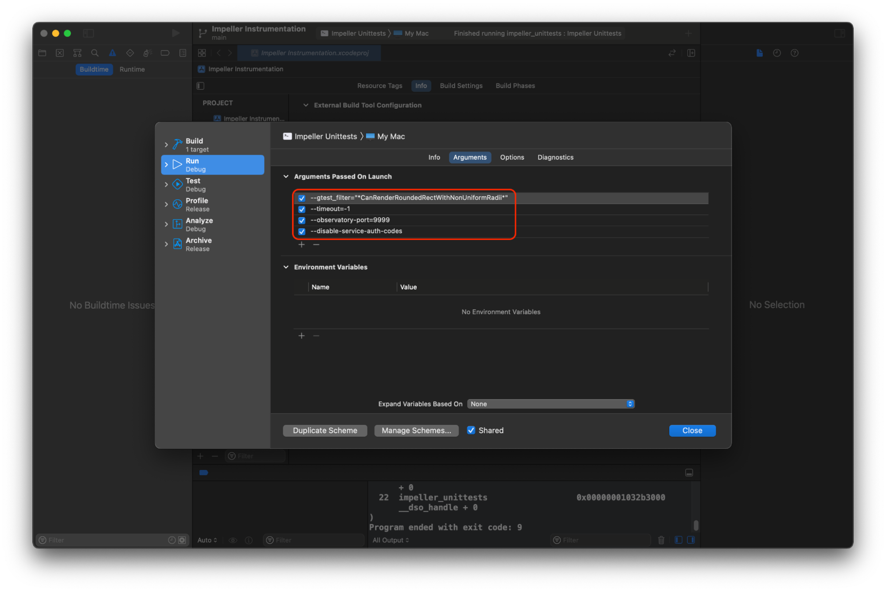

This is also the spot where you will add other command line arguments that will
aid in your debugging. In that example, `–timeout=-1` will disable the Flutter
test hang watchdog which will kill your process if the test doesn’t complete in
30 seconds. I also like to set the observatory port to a known value so I can
get to it and disable service auth codes so I can just refresh the page to
launch the latest version of the observatory.
