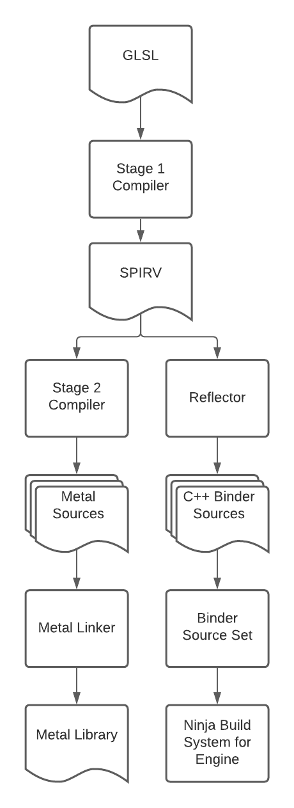

# Shader Compiler

Location: `//impeller/compiler`

The offline shader compiler. Takes GLSL 4.60 shader source code and converts it
into a backend specific shader representation (like Metal Shading Language).
It also generates C++ bindings that callers can include as a GN `source_set`s
so there is no runtime shader reflection either. The target is an executable
called `impellerc` which is never shipped into the binary or as an artifact.

## Shader Compiler Explorer

An interactive instance of the shader compiler is available online at [https://compiler.impeller.dev](https://compiler.impeller.dev)

## The Offline Shader Compilation Pipeline

* Shaders are authored once in GLSL 4.60. This choice of shading language is
  consistent across all backends. Shader code resides in the Impeller source
  tree like any other source file.
* At build time, the Impeller Shader Compiler (`impellerc`) converts the GLSL
  into SPIRV. No optimizations are performed on the generated SPIRV at this
  stage. This is to preserve all debugging and instrumentation information.
* Using the SPIRV, a backend specific transpiler converts the SPIRV to the
  appropriate high-level shading language. This is controlled using flags to the
  `impellerc`.
* All the files generated in the high-level shading language are compiled,
  optimized, and linked into a single binary blob.
* The binary blob containing the compiled and optimized high-level shading
  language is included as a hex dump (see `xxd.py`) into a C source file with a
  generated GN target. Executable targets that want to include the compiled code
  in their binaries just need to depend on the generated GN target. This eases
  any shader packaging concerns.
* In parallel, the SPIRV is processed by a reflector. This produces C++
  translation units that allow for the easy creation of pipeline state objects
  at runtime. The headers for these translation units include any structs (with
  appropriate padding and alignment) such that uniform data as well as vertex
  information can be specified to the shader without having to deal with
  bindings, vertex descriptors, etc.. This also makes iterating on shaders
  easier as changes to the shader interface lead to compile time errors.
* The C++ translation units generated from reflected shader information are made
  available to callers as a generated GN target that callers may use if
  necessary. It is possible for callers to perform reflection at runtime but
  there are no Impeller components that do this currently.

