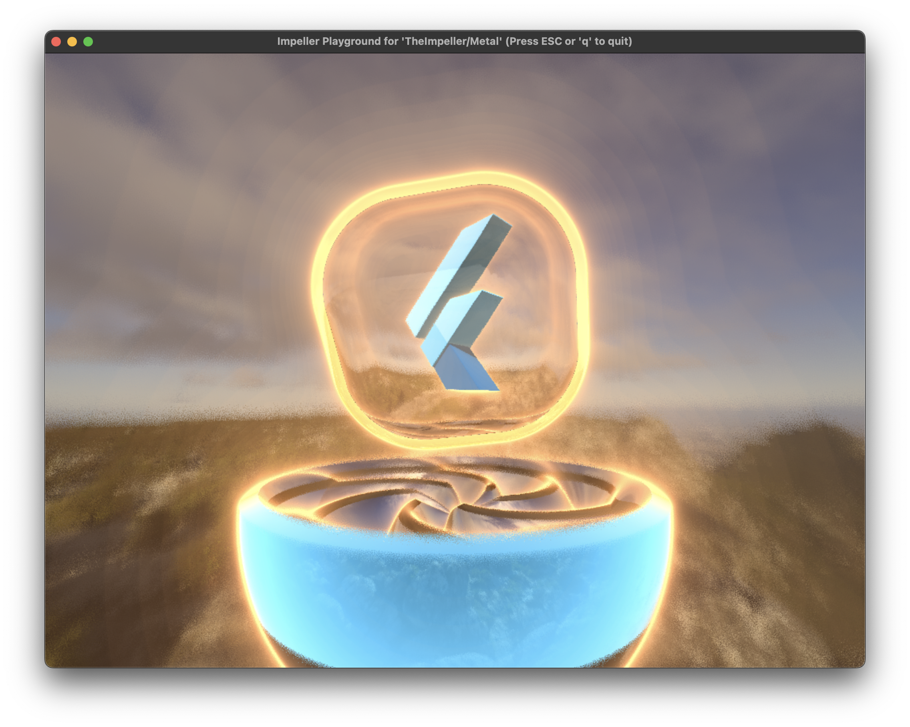

Impeller is a rendering runtime for Flutter with the following objectives:

* **Predictable Performance**: All shader compilation and reflection is
  performed offline at build time. All pipeline state objects are built upfront.
  Caching is explicit and under the control of the engine.
* **Instrumentable**: All graphics resources (textures, buffers, pipeline state
  objects, etc..) are tagged and labeled. Animations can be captured and
  persisted to disk without affecting per-frame rendering performance.
* **Portable**: Not tied to a specific client rendering API. Shaders are
  authored once and converted as necessary.
* **Uses Modern Graphics APIs Effectively**: Makes heavy use of (but doesn’t
  depend on) features available in Modern APIs like Metal and Vulkan.
* **Makes Effective Use of Concurrency**: Can distribute single-frame workloads
  across multiple threads if necessary.
